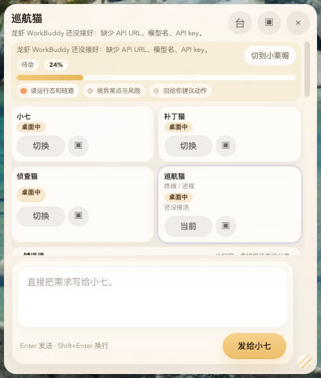
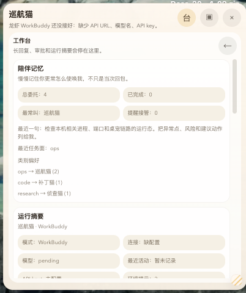
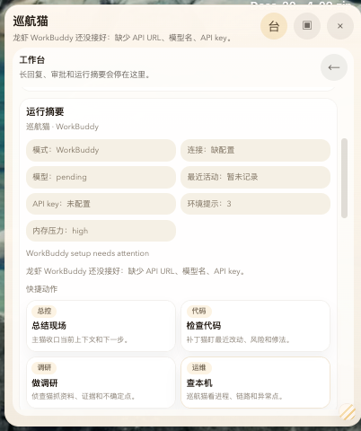
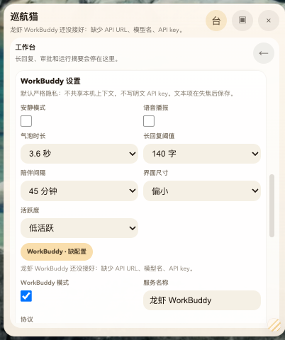
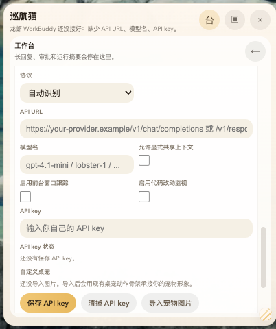
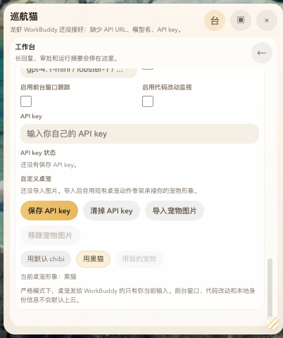
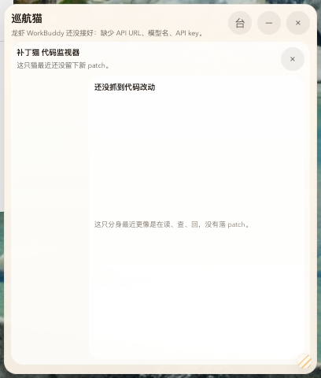
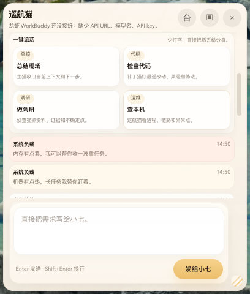
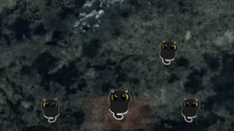

# WorkBuddy Pet

<div align="center">
  <p>A local-first desktop pet you can use right after install. Without an API key it stays cute and offline; once you add your own API URL, model, and API key, it becomes your personal WorkBuddy.</p>
</div>

<div align="center">


</div>

<div align="center">
  <a href="https://github.com/omaro-alphaneAI/open-claw-destk-work-buddy/releases">Download Releases</a>
  ·
  <a href="#screenshots">Screenshots</a>
  ·
  <a href="#quick-start">Quick Start</a>
  ·
  <a href="#privacy-defaults">Privacy Defaults</a>
  ·
  <a href="./docs/USER_GUIDE.en.md">User Guide</a>
  ·
  <a href="./README.md">中文 README</a>
</div>

---

<p align="center">
  
</p>

## Why this exists

Most desktop assistants start by asking you to log in, bind to a fixed cloud, or ship local context outward by default. `WorkBuddy Pet` flips that model: first you get a desktop pet that can stay cute, local, and useful on its own, then you decide whether to wire it to your own model endpoint.

It is local-first by default. Without an API key, it is just a desktop pet. Only after you explicitly enter your own `API URL`, `Model`, and `API key` does it turn into your WorkBuddy.

## What you get

- Works immediately after install, even with no API configured
- `WorkBuddy Mode` connects to your own OpenAI-compatible endpoint
- Local paths, file contents, window titles, diffs, env vars, and clipboard data are blocked by default
- Built-in workbench, run summaries, quick actions, chat feed, and patch viewer
- Supports custom pet image imports so users can turn their own pet art into the desktop pet
- Packaged for macOS, Windows, and Linux with GitHub Releases workflows

## Two modes

| Mode | Requires API | What happens |
| --- | --- | --- |
| `Cute Mode` | No | Local-only pet behavior, reminders, and companionship work out of the box |
| `WorkBuddy Mode` | Yes | After entering your own `API URL`, `Model`, and `API key`, the pet becomes your personal work companion |

## Screenshots

### Workbench and configuration

| Memory and summary | Run summary |
| --- | --- |
|  |  |
| The workbench keeps memory, recent task state, and clone usage in one place. | Missing API URL, model, and API key are surfaced clearly before WorkBuddy is fully configured. |

| Core settings | Provider and protocol config |
| --- | --- |
|  |  |
| Quiet mode, bubble timing, activity level, and UI sizing are adjustable. | Supports `Auto`, `Chat Completions`, and `Responses API` protocol modes. |

| API key and pet import | Patch viewer |
| --- | --- |
|  |  |
| Users can save their own API key and import their own pet image. | When there is no recent code change, the patch viewer says so explicitly. |

### Chat and clones

| Clone rack and composer | Chat feed and actions |
| --- | --- |
|  |  |
| The clone rack can route work to different roles, and the bottom composer talks directly to the pet. | Quick actions such as summary, code, research, and system inspection are available from the workbench. |

### Pet skins

| Default black cat | Custom pet image |
| --- | --- |
|  |  |
| The app ships with a default black cat pet. | Users can swap in their own pet image locally. |

## Quick Start

### Option 1: use a packaged release

1. Open [GitHub Releases](https://github.com/omaro-alphaneAI/open-claw-destk-work-buddy/releases)
2. Download the installer for your platform
3. Install and launch the app
4. Use `Cute Mode` immediately, even without an API
5. When you want `WorkBuddy Mode`, open the workbench and fill in:
   - `API URL`
   - `Model`
   - `API key`
6. If you want a different pet look, import your own image

### Option 2: run from source

```bash
npm install
npm run dev
```

### macOS one-click Desktop launcher

After building the app, you can install it into `~/Applications` and generate a `桌宠.app` launcher on the Desktop:

```bash
npm run dist:mac
npm run desktop:install
```

## Privacy Defaults

By default, `WorkBuddy Mode` sends only the text the user explicitly enters.

The following are blocked from remote upload by default:

- Local file paths
- Local file contents
- Foreground app names and window titles
- Code diff snapshots
- Environment variables
- Clipboard contents
- Home directory details
- Any local identity/profile files

Additional outbound safeguards:

- `HTTPS` is required by default
- `HTTP` is allowed only for loopback endpoints such as `localhost`, `127.0.0.1`, and `::1`
- Redirects are blocked
- Embedded credentials and sensitive query params inside `API URL` are blocked
- Explicitly shared local context is redacted before request dispatch

### API key storage

- macOS / Windows: Electron `safeStorage` first
- Linux: falls back to session-only memory storage when the environment only offers an insecure `basic_text` backend

## API Compatibility

`WorkBuddy Mode` currently uses a generic OpenAI-compatible request layer:

- Method: `POST`
- Auth: `Authorization: Bearer <apiKey>`
- Supported protocol styles:
  - `Auto`
  - `Chat Completions`
  - `Responses API`

Auto-detection rules:

- `/v1/chat/completions` -> `Chat Completions`
- `/v1/responses` -> `Responses API`

So if your Lobster endpoint matches either route, it can be connected directly. If not, keep adapting [src/main/workbuddy-provider.js](./src/main/workbuddy-provider.js).

## Docs

- [User Guide (English)](./docs/USER_GUIDE.en.md)
- [用户操作指南（中文）](./docs/USER_GUIDE.zh-CN.md)
- [GitHub Release Guide (English)](./docs/RELEASE_GUIDE.en.md)
- [GitHub 发布指南（中文）](./docs/RELEASE_GUIDE.zh-CN.md)

## Development and Packaging

### Local development

```bash
npm install
npm run dev
npm run smoke:rules
```

### Build commands

```bash
npm run pack
npm run dist:mac
npm run dist:win
npm run dist:linux
```

### GitHub Actions

Cross-platform build and release workflows are already included:

- [build-workbuddy.yml](./.github/workflows/build-workbuddy.yml)
- [release-workbuddy.yml](./.github/workflows/release-workbuddy.yml)

Push a version tag to build and publish release artifacts:

```bash
git tag v0.1.0
git push origin v0.1.0
```
